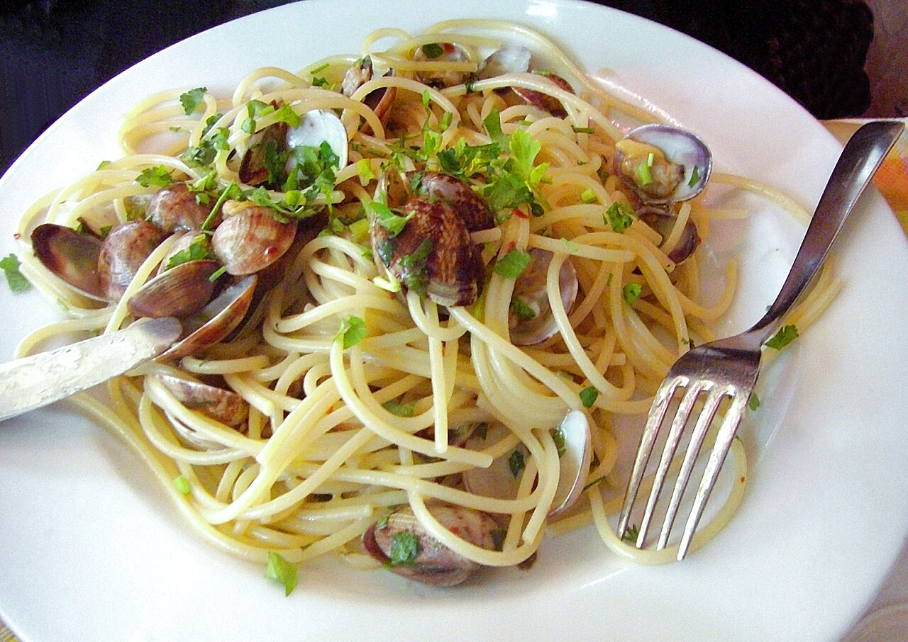

# 봉골레 파스타 — 집에서 완성

바지락 해감만 미리 해두면 20분 안에 레스토랑 못지않은 맛이 나와요.

## 재료 (1인분)
- 스파게티면 100g
- 바지락 200~300g (해감 완료)
- 마늘 3~4쪽 (편 썰기)
- 페페론치노 1~2개 (또는 청양고추, 선택)
- 화이트와인 3큰술 (없으면 청주나 맛술로 대체 가능)
- 올리브오일 3큰술
- 이탈리안 파슬리 약간 (선택, 없으면 생략 가능)
- 소금, 통후추 약간
- 면수(파스타 삶은 물) 약간

## 만드는 법
1. **바지락 해감** — 소금물(물 1L + 소금 2큰술)에 바지락을 담가 어두운 곳에서 30분~1시간 해감 후 서로 비벼 씻기
2. **면 삶기** — 끓는 물에 소금 넣고 스파게티를 봉지 표기 시간보다 1분 짧게 삶기 (면수는 따로 한 컵 남겨두기)
3. **마늘 볶기** — 팬에 올리브오일 두르고 약불에서 마늘, 페페론치노를 향이 날 때까지 천천히 볶기 (태우지 않기)
4. **바지락 투하** — 중강불로 올려 바지락 넣고 화이트와인 부어 뚜껑 덮고 1~2분 찌기
5. **입 벌어지면** — 바지락 입이 벌어지면 면수 한 국자 넣고 살짝 섞기
6. **면 합치기** — 삶은 면을 넣고 팬을 흔들며 30초~1분 강불에서 유화시키듯 볶기 (너무 되직하면 면수 추가)
7. **마무리** — 불 끄고 올리브오일 한 바퀴, 후추 톡톡, 파슬리 뿌려서 완성

## 팁
- 바지락은 입을 벌리지 않는 것은 골라내고, 너무 오래 익히면 질겨지니 벌어지면 바로 다음 단계로 넘어가세요.
- 소금간은 마지막에! 바지락 자체와 면수에 짠맛이 있어서 소금을 따로 안 넣어도 될 때가 많아요.
- 화이트와인이 없으면 그냥 면수만으로도 깔끔하게 만들 수 있어요.
- 매콤하게 먹고 싶으면 페페론치노 대신 청양고추를 송송 썰어 넣어도 좋아요.

20분이면 완성되는 메뉴예요. 맛있게 드세요!
