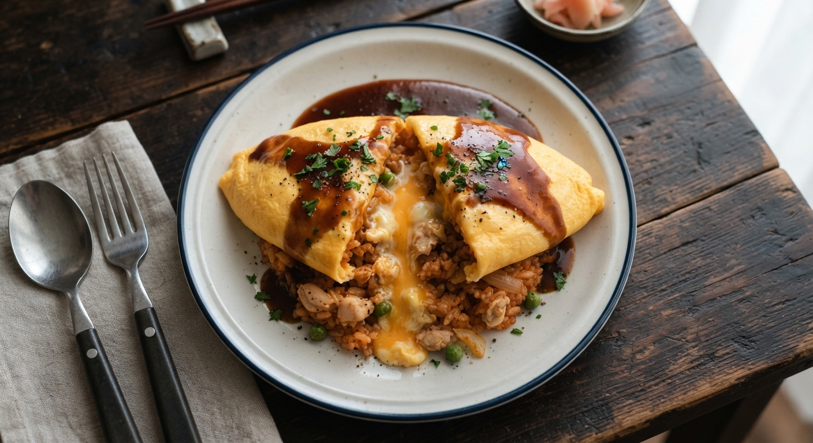

# 진짜 맛있는 간단 오므라이스 🍳

## 재료 (2인분)

**볶음밥**
- 밥 2공기 (찬밥이 좋음)
- 양파 1/2개, 다진 것
- 당근 1/4개, 다진 것
- 스팸 또는 베이컨 100g (없으면 소시지도 OK)
- 케첩 4큰술
- 버터 1큰술
- 소금, 후추 약간

**계란**
- 계란 3개 (1인분당)
- 우유 1큰술 (부드러워짐)
- 소금 한 꼬집

**소스 (선택, 근데 강추)**
- 케첩 3큰술 + 돈까스소스 1큰술 + 물 2큰술 → 살짝 끓이기

## 만드는 법

### 1. 볶음밥 만들기
1. 팬에 버터 두르고 양파, 당근 먼저 볶다가 스팸 넣고 볶기
2. 재료 익으면 밥 넣고 골고루 볶기
3. 불 살짝 줄이고 케첩 넣어서 **밥알 하나하나에 배도록** 충분히 볶기 (이게 맛의 핵심 — 케첩을 날것처럼 넣지 말고 볶아서 신맛을 날려야 함)
4. 소금, 후추로 간 맞추고 그릇에 담아 밥공기로 눌러 모양 잡기

### 2. 계란 지단
1. 계란 잘 풀어서 우유, 소금 넣고 다시 풀기 (체에 한번 걸러주면 더 부드러움)
2. 팬에 기름 두르고 **약불~중약불**에서 계란물 붓기
3. 젓가락으로 살살 저어 스크램블처럼 만들다가, 반숙 상태에서 불 끄고 모양 잡기 (너무 익히면 딱딱해짐 — 반숙이 포인트)

### 3. 완성
1. 볶음밥 위에 반숙 계란을 살포시 덮기
2. 가운데를 칼로 살짝 갈라 열어주면 계란이 자연스럽게 밥을 감싸는 모양
3. 케첩 소스 뿌리기 (또는 그냥 케첩으로 하트나 글씨)

## 맛있게 만드는 꿀팁
- **찬밥 필수**: 갓 지은 밥은 질어서 볶음밥이 떡짐
- **케첩은 반드시 볶기**: 날케첩 냄새 vs 볶은 케첩 감칠맛, 차이 큼
- **계란은 약불 + 반숙**: 팬 뜨거우면 바로 익어버려서 지단이 안 예쁘고 질겨짐
- 마지막에 버터 한 조각 볶음밥에 톡 올리면 풍미 확 살아남

간단한데 포인트만 지키면 경양식집 느낌 납니다. 더 진하게 하고 싶으면 데미글라스 소스로 바꿔도 좋아요.
