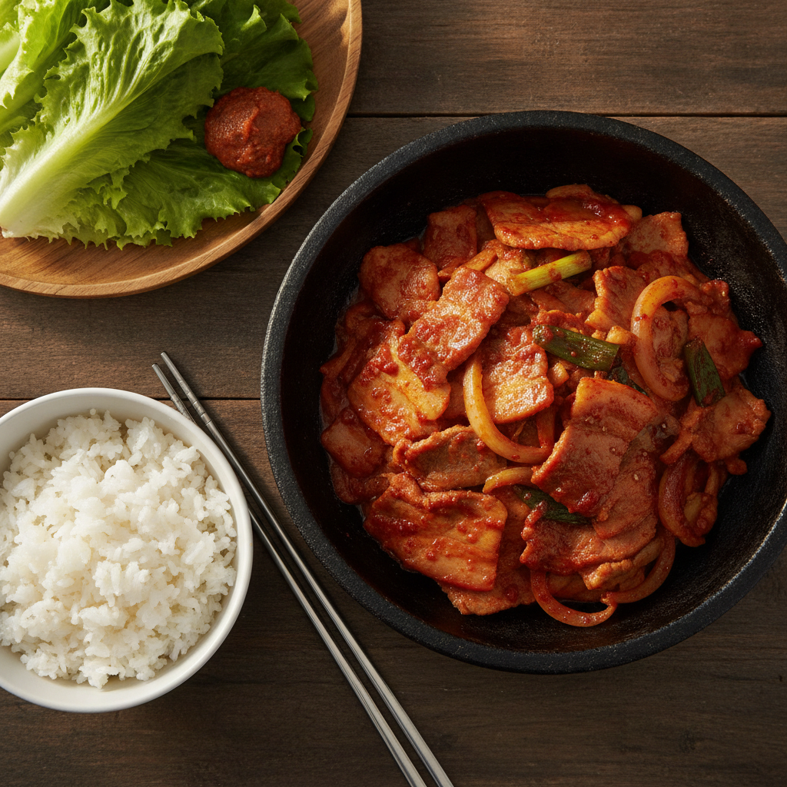

# 제육볶음 (매콤 돼지고기 볶음)

돼지고기로 만드는 대표적인 한식 반찬. 밥 위에 얹어 먹거나 상추쌈으로 먹기 좋아요.

## 재료 (2인분)

- 돼지고기 앞다리살 또는 목살 (불고기용) 400g
- 양파 1/2개
- 대파 1대
- 청양고추 2개 (매콤하게, 더 맵게 하려면 추가)
- 양배추 1/4개 (선택)

### 양념장
- 고추장 2큰술
- 고춧가루 1큰술
- 간장 1큰술
- 설탕 1큰술
- 다진 마늘 1큰술
- 다진 생강 약간
- 맛술(청주) 1큰술
- 후추 약간
- 식용유 1큰술

## 만드는 법

1. 양념장 재료를 모두 섞어 미리 만들어 둔다.
2. 돼지고기에 양념장의 절반을 넣고 15~20분간 재운다.
3. 양파는 채 썰고, 대파와 청양고추는 어슷 썬다. 양배추를 넣는다면 한입 크기로 썬다.
4. 팬에 식용유를 두르고 센 불에서 재운 돼지고기를 볶는다.
5. 고기가 반쯤 익으면 양파, 양배추와 남은 양념장을 넣고 함께 볶는다.
6. 고기가 완전히 익고 야채가 살짝 숨이 죽으면 대파와 청양고추를 넣고 1~2분 더 볶는다.
7. 불을 끄고 그릇에 담아 완성.

## 팁

- 미리 재워두면 간이 더 잘 배어 맛있어요.
- 밥, 상추, 깻잎과 함께 쌈으로 먹으면 더 맛있습니다.
- 매운맛을 줄이고 싶다면 고춧가루 양을 줄이세요.
- 더 맵게 먹고 싶다면 청양고추를 추가하세요.
