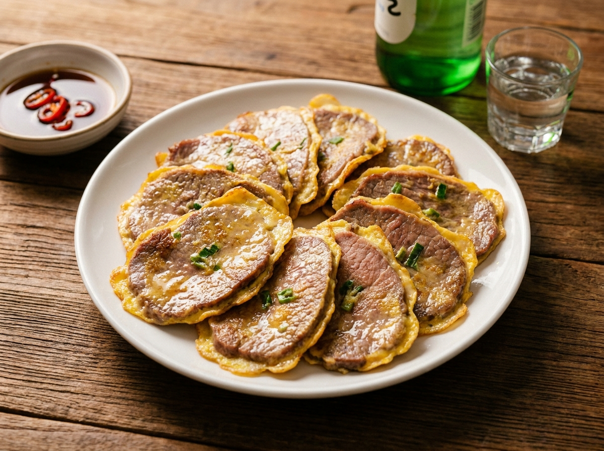

# 소고기 육전 (계란옷 입혀 부쳐내는 술상 안주)

기름에 부쳐낸 고소한 계란옷과 부드러운 소고기, 새콤한 초간장이 소주와 잘 맞는 클래식 안주. 재료가 단순하고 20분이면 접시에 올라간다.

## 재료 (2인분)

- 육전용 소고기 (홍두깨살·부채살, 두께 3mm) 300g
- 달걀 3개
- 부침가루 4큰술
- 쪽파 2대
- 식용유 3큰술
- 소금 1/3작은술
- 후추 약간

### 밑간
- 맛술(청주) 1큰술
- 소금 1/3작은술
- 후추 약간

### 초간장
- 간장 2큰술
- 식초 1큰술
- 물 1큰술
- 설탕 1/2작은술
- 청양고추 1개 (다져서)

## 만드는 법

1. 소고기를 키친타월 사이에 놓고 5분간 눌러 핏물과 물기를 뺀다. **물기가 남으면 부칠 때 계란옷이 벗겨진다.**
2. 고기에 밑간 재료를 넣고 살살 버무려 10분간 재운다.
3. 달걀 3개를 풀고 소금 1/3작은술을 넣어 섞은 뒤, 쪽파를 송송 썰어 넣는다. 거품은 걷어낸다.
4. 재운 고기 양면에 부침가루를 얇게 묻히고 **여분은 반드시 털어낸다.** 두껍게 묻으면 질겨진다.
5. 팬을 중약불에서 2분간 예열하고 식용유 1큰술을 두른다. **센 불은 금물 — 계란옷이 먼저 탄다.**
6. 고기를 달걀물에 담갔다 꺼내 팬에 펼쳐 올리고 중약불에서 1분 30초간 부친다.
7. 가장자리 계란이 익어 노랗게 굳으면 뒤집어 1분간 더 부친다. 고기가 얇아 이 정도면 충분히 익는다.
8. 키친타월에 잠깐 올려 기름을 빼고, 남은 반죽도 같은 방법으로 부친다. 팬이 지저분해지면 닦고 기름을 새로 두른다.
9. 접시에 겹쳐 담고 초간장 재료를 섞어 곁들인다.

## 팁

- 정육점에서 "육전용으로 얇게 썰어주세요"라고 하면 손질이 끝나 있어요. 두꺼우면 질겨집니다.
- 부침가루가 없으면 밀가루를 체에 쳐서 써도 돼요. 대신 소금 간을 조금 더 하세요.
- 달걀물에 쪽파 대신 부추나 당근채를 넣으면 색이 훨씬 예뻐요.
- 식은 육전은 에어프라이어 170도에서 3분 돌리면 처음처럼 살아납니다.
- 매콤하게 먹고 싶으면 초간장에 고춧가루 1/2작은술을 더 넣으세요.
