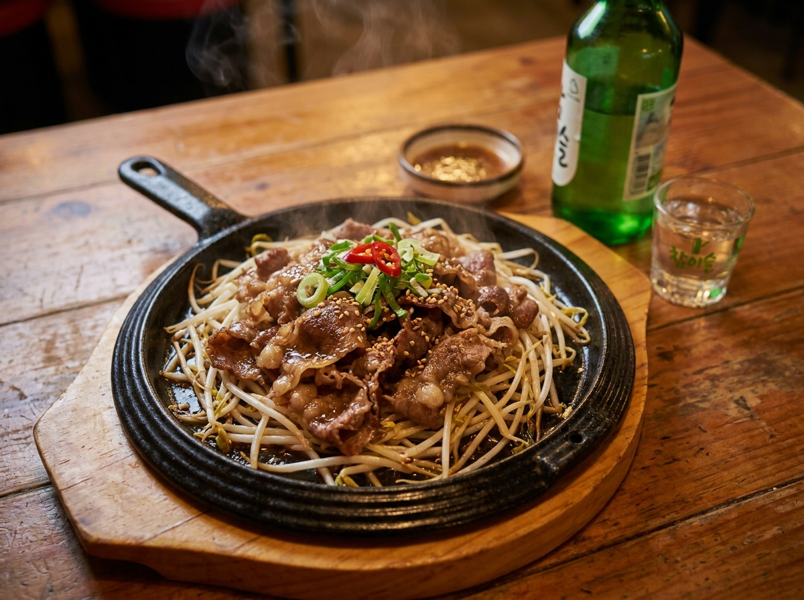

# 차돌박이 숙주볶음 (소주 안주용 고기 레시피)

불 앞에 서서 15분이면 끝나는 포장마차식 소주 안주. 고소한 차돌박이 기름에 숙주를 아삭하게 볶아내는 게 전부라서 퇴근하고 저녁에 만들기 딱 좋아요.

## 재료 (2인분)

- 차돌박이 300g
- 숙주 300g (1봉지)
- 대파 1대
- 청양고추 2개
- 다진 마늘 1큰술
- 부추 한 줌 (선택)
- 통깨, 후추 약간
- 참기름 1작은술 (마무리용)

### 양념장
- 간장 2큰술
- 굴소스 1큰술
- 맛술(청주) 1큰술
- 설탕 1작은술
- 고춧가루 1작은술 (매콤하게 먹고 싶을 때)

### 찍어 먹는 소스 (선택)
- 간장 1큰술 + 식초 1큰술 + 연겨자 1/2작은술

## 만드는 법

1. 숙주는 흐르는 물에 씻어 체에 밭쳐 물기를 완전히 뺀다. **물기가 남으면 볶을 때 물이 생긴다.**
2. 대파와 청양고추는 어슷 썰고, 부추는 5cm 길이로 썬다. 양념장 재료는 미리 섞어 둔다.
3. 팬을 센 불에 충분히 달군다. 기름은 두르지 않는다 — 차돌박이에서 기름이 나온다.
4. 차돌박이를 펼쳐 넣고 30초~1분, 겉면이 갈색으로 익을 때까지만 굽는다. 오래 구우면 질겨진다.
5. 고기 기름에 다진 마늘, 대파, 청양고추를 넣고 30초간 향을 낸다.
6. 숙주를 한 번에 넣고 양념장을 두른 뒤, **센 불에서 1분 30초 이내로** 크게 뒤집듯 볶는다.
7. 숙주가 살짝 숨이 죽으면 바로 불을 끄고 부추, 참기름, 통깨, 후추를 넣어 섞는다.
8. 달군 무쇠팬이나 그릇에 그대로 담아 뜨거울 때 낸다.

## 팁

- 차돌박이는 냉동 상태에서 살짝 해동해 한 장씩 떼어 넣으면 안 뭉쳐요.
- 숙주는 **아삭함이 생명**입니다. 익히는 게 아니라 데우는 느낌으로 짧게 볶으세요.
- 물이 생겼다면 불을 최대로 올려 30초만 더 볶아 수분을 날리면 됩니다.
- 남은 국물에 밥을 볶아 먹으면 술자리 마무리로 좋아요.
- 소주와 함께라면 청양고추 2개는 넣는 걸 추천합니다.
