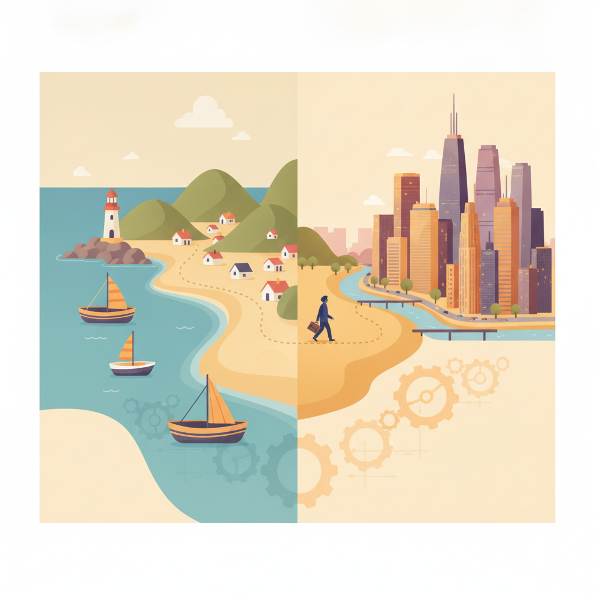

안녕하세요. 저는 박건우입니다.

거제도에서 태어나 스무 살에 서울로 올라왔고, 대학교에서는 산업공학을 전공하며 논리적으로 문제를 분석하고 구조화하는 방법을 배웠습니다.

현재는 회사에서 웹 및 앱 서비스의 UI/UX 기획 업무를 맡아, 사용자의 니즈를 파악하고 이를 실제 서비스 화면으로 설계하는 일을 하고 있습니다.

이번 강의를 듣게 된 이유도 여기서 출발합니다. 기획자로서 좋은 아이디어를 내는 것에서 그치지 않고, 직접 개발까지 이해하고 구현할 수 있는 사람이 되고 싶다는 생각이 들었습니다. 기획과 개발을 넘나드는 멀티플레이어로 성장하는 것이 저의 목표이며, 그 첫걸음으로 이 강의를 수강하게 되었습니다.

잘 부탁드립니다.