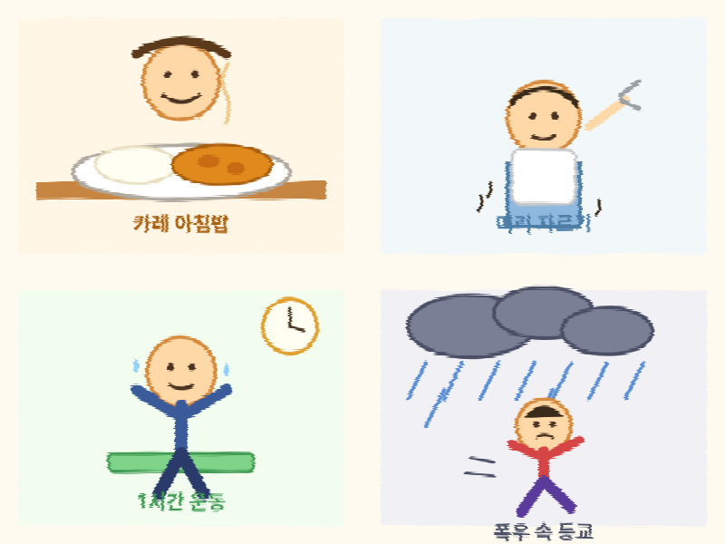
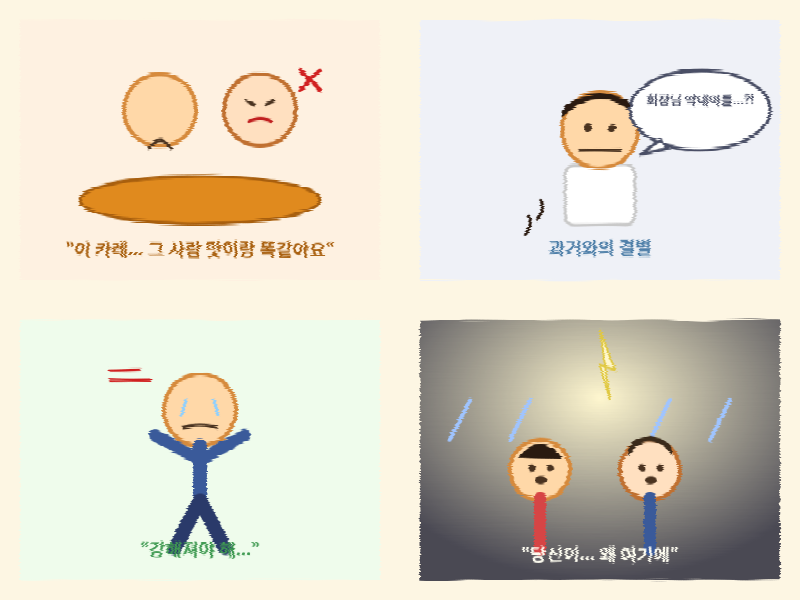

## 오늘의 일기

누
### — 제 1화: "카레 한 그릇의 비밀" —

아침 식탁에 오른 카레 한 그릇. 평범해 보였지만, 그 안엔 평범하지 않은 진실이 숨어 있었다. "엄마... 이 카레, 예전에 그 사람이 끓여주던 맛이랑 똑같아요." 나는 숟가락을 떨어뜨렸다. 어머니의 손이 미세하게 떨렸다. "그, 그럴 리가... 그건 그냥 우연이야." 나는 알고 있었다. 이 집엔 20년째 감춰진 비밀이 있다는 것을.

### — 제 2화: "머리를 자른 자, 과거와 결별하다" —

밥그릇을 두 그릇이나 비운 뒤, 나는 거울 앞에 섰다. "이제 예전의 나는 없어." 미용실 의자에 앉아 긴 머리카락이 바닥에 떨어지는 순간, 원장님이 조용히 속삭였다. "손님... 혹시 재단 회장님 막내아들 아니세요?" 나는 대답 대신 씁쓸한 미소만 지었다. 거울 속엔 낯선, 그러나 어딘가 낯익은 얼굴이 있었다.

### — 제 3화: "땀과 눈물의 1시간" —

집에 돌아와 나는 운동을 시작했다. 스쿼트를 하며 흘리는 땀 한 방울 한 방울에는 지난 세월의 설움이 녹아 있었다. "강해져야 해. 더 이상 누구에게도 이용당하지 않을 거야." 유튜브 트레이너의 구호 소리가 마치 나를 향한 응원처럼 들렸다. 1시간 뒤, 거울에 비친 나는 완전히 다른 사람이 되어 있었다.

### — 제 4화: "폭우, 그리고 재회" —

수업을 들으러 나선 순간, 하늘이 찢어질 듯 어두워졌다. 그리고 — 쏟아지는 빗속에서, 나는 그 사람과 마주쳤다. "당신이... 왜 여기에." 우산도 없이 흠뻑 젖은 채 서로를 바라보는 두 사람. 천둥이 내리치고, 카메라는 슬로우모션으로 두 사람의 얼굴을 클로즈업한다. "이 비가 그치면... 우리, 다시 시작할 수 있을까요?" 그렇게, 예상치 못한 방학의 하루는 한 편의 드라마처럼 막을 내렸다.

*(다음 화에 계속...)*