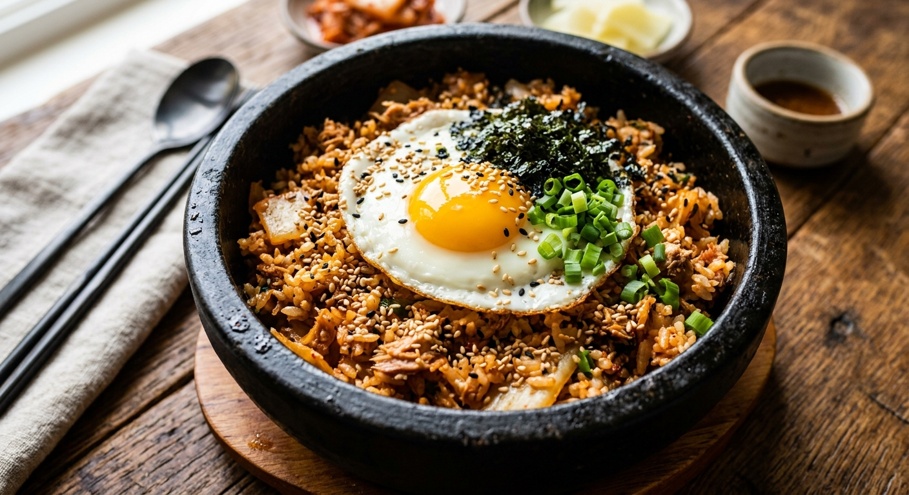

# 참치김치볶음밥 — 10분 완성

*AI 생성 이미지 (Gemini nano-banana)*

집에서 흔히 있는 재료로 빠르고 확실하게 맛있는 한 그릇 요리예요.

## 재료 (1인분)
- 밥 1공기 (찬밥이면 더 좋음)
- 신김치 1/2컵 (잘게 썰기)
- 참치캔 1/2개 (기름 살짝 빼기)
- 대파 또는 양파 약간 (선택)
- 고추장 1작은술
- 설탕 1/2작은술
- 참기름 1작은술
- 식용유 1큰술
- 계란 1개 (반숙 프라이용)
- 김가루, 통깨 약간 (선택)

## 만드는 법
1. **팬 달구기** — 식용유 두르고 중강불로 예열 (30초)
2. **김치 볶기** — 김치 넣고 1~2분 볶아 신맛 날리기, 설탕 넣어 볶기
3. **참치 & 고추장** — 참치와 고추장 넣고 30초 더 볶기
4. **밥 투하** — 밥 넣고 잘 섞으며 2~3분 볶기 (눌어붙기 직전까지)
5. **마무리** — 불 끄고 참기름 둘러 섞기
6. **계란프라이** — 다른 팬(또는 같은 팬 한쪽)에 계란 반숙프라이 얹기
7. 그릇에 담고 김가루, 통깨 뿌려서 완성

## 팁
- 찬밥을 쓰면 질척이지 않고 훨씬 고슬고슬해요.
- 신김치가 없으면 식초 몇 방울 추가해도 비슷한 맛이 나요.
- 계란프라이 대신 치즈 한 장 올려도 꿀조합입니다.

10분 안에 딱 나오는 메뉴예요. 맛있게 드세요!
