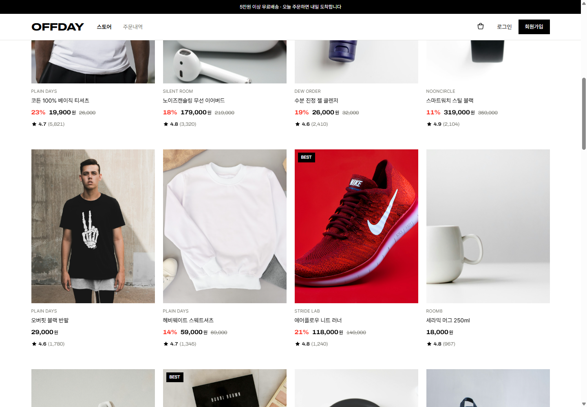
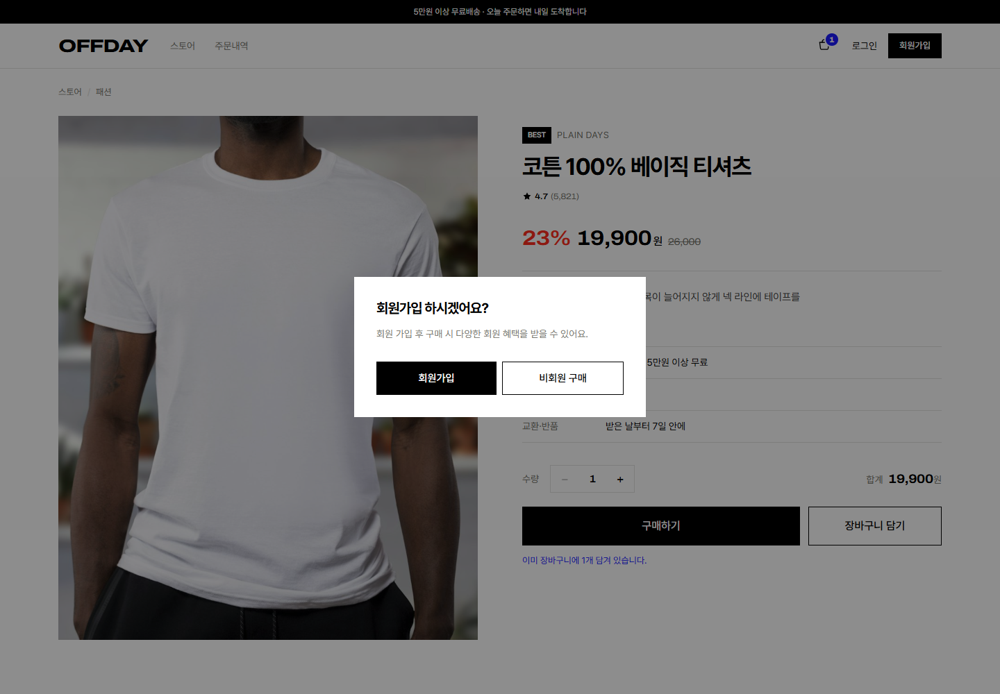
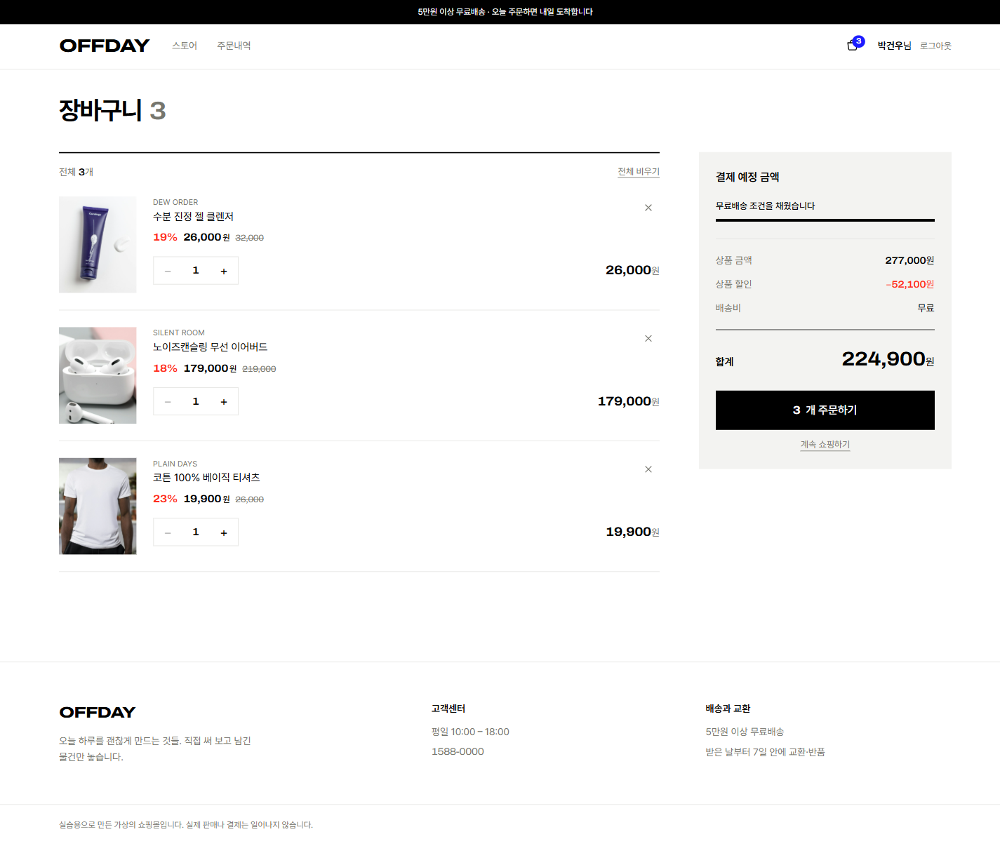

# OFFDAY — 쇼핑몰

상품 목록 · 회원가입/로그인 · 장바구니를 갖춘 쇼핑몰. 데이터는 Supabase PostgreSQL 에 저장한다.



## 실행

```bash
npm install
npm start          # http://localhost:3013
```

`.env` 가 필요하다. `.env.example` 을 복사해 값을 채운다.

```
DATABASE_URL=postgresql://postgres.<project-ref>:<password>@aws-0-us-east-1.pooler.supabase.com:5432/postgres
JWT_SECRET=<32자 이상 랜덤 문자열>
PORT=3013
```

> Supabase 의 `db.<ref>.supabase.co` 직접 호스트는 IPv6 전용이라 붙지 않는다. **IPv4 Session pooler** 주소를 쓴다.
> `JWT_SECRET` 만들기: `node -e "console.log(require('crypto').randomBytes(32).toString('hex'))"`

서버가 처음 뜰 때 테이블을 만들고 상품 30개를 넣는다. `slug` 가 겹치면 건너뛰므로 여러 번 실행해도 안전하다.

## 화면

해시 라우팅이라 주소 뒤에 `#/...` 가 붙는다.

| 주소 | 화면 | 로그인 |
|---|---|---|
| `/#/` | 홈 — 히어로, 카테고리/정렬/검색, 상품 30개 | 불필요 |
| `/#/product/:id` | 상품 상세 + 같은 카테고리 추천 | 불필요 |
| `/#/login`, `/#/signup` | 로그인 · 회원가입 | — |
| `/#/cart` | 장바구니 — 수량 변경, 삭제, 합계 | 불필요 |
| `/#/checkout` | 주문 / 결제 — 받는 분 정보 + 결제 금액 | 불필요 |
| `/#/orders` | 주문내역 | 필요 |

### 로그인하지 않은 사람

- **장바구니 담기** 는 그냥 담긴다. 상품 목록은 브라우저(`localStorage`)에 남고, 금액은 그때그때 서버에 물어본다.
- **구매하기** 를 누르면 먼저 물어본다 — *"회원 가입 후 구매 시 다양한 회원 혜택을 받을 수 있어요. 회원가입 하시겠어요?"*
  - **회원가입** → 가입 화면으로 갔다가, 가입을 마치면 보던 상품으로 돌아온다
  - **비회원 구매** → 주문/결제 화면으로 바로 넘어간다
- 로그인하거나 가입하면, 비회원으로 담아 둔 상품이 계정 장바구니로 합쳐진다. 같은 상품이면 수량을 더한다.



구매하기는 이미 담긴 상품이면 수량을 더하지 않고 상세 화면에서 고른 수량으로 맞춘다.

## API

🔒 표시된 것만 `Authorization: Bearer <token>` 이 필요하다.

| 메서드 | 경로 | 하는 일 |
|---|---|---|
| GET | `/api/products?category=&q=&sort=` | 상품 목록. `sort` 는 `recommend·new·price_asc·price_desc·discount·rating` |
| GET | `/api/products/:id` | 상품 하나 + 같은 카테고리 4개 |
| POST | `/api/auth/signup` | 가입 후 토큰 발급 |
| POST | `/api/auth/login` | 로그인 후 토큰 발급 |
| GET | `/api/auth/me` 🔒 | 토큰으로 내 정보 확인 |
| POST | `/api/cart/quote` | 비회원이 들고 있는 `[{productId, qty}]` 를 서버 가격으로 계산 |
| POST | `/api/cart/merge` 🔒 | 비회원 장바구니를 계정으로 옮긴다 |
| GET | `/api/cart` 🔒 | 장바구니 + 합계 |
| POST | `/api/cart` 🔒 | 담기. 이미 있으면 수량을 더한다(최대 20) |
| PATCH | `/api/cart/:productId` 🔒 | 수량을 그 값으로 바꾼다 |
| DELETE | `/api/cart/:productId` 🔒 | 한 상품 빼기 |
| DELETE | `/api/cart` 🔒 | 전체 비우기 |
| POST | `/api/orders` 🔒 | 장바구니를 주문으로 옮기고 비운다(트랜잭션) |
| POST | `/api/orders/guest` | 비회원 주문. 받은 상품 목록을 서버 가격으로 다시 계산해 넣는다 |
| GET | `/api/orders` 🔒 | 내 주문내역 |

합계는 서버가 계산해서 내려준다. 5만원 이상이면 배송비 0원, 아니면 3,000원.
**금액은 클라이언트가 보낸 값을 쓰지 않는다.** 비회원이 보내는 건 상품 번호와 수량뿐이고, 가격은 항상 DB 에서 다시 읽는다.

## 테이블

| 테이블 | 담는 것 |
|---|---|
| `sh_users` | 이메일, bcrypt 해시, 이름 |
| `sh_products` | 상품명, 브랜드, 카테고리, 판매가/정가, 이미지, 설명, 평점, 재고 |
| `sh_cart_items` | `(user_id, product_id)` 유니크 + 수량. 회원 장바구니만 여기 남는다 |
| `sh_orders` / `sh_order_items` | 주문번호·결제금액·받는 분 정보 / 주문 당시의 상품명·가격 사본 |

주문 항목은 상품 정보를 복사해 둔다. 나중에 상품 가격이 바뀌어도 지난 주문 금액은 그대로 남는다.
`sh_orders.user_id` 가 비어 있으면 비회원 주문이다. 비회원 장바구니는 DB 에 남기지 않고 브라우저에만 둔다.

## 파일

| 파일 | 내용 |
|---|---|
| `server.js` | Express 서버 하나. 정적 파일 서빙 + DB + 인증 + API |
| `seed-data.js` | 시드 상품 30개 |
| `index.html` | React 18 + Tailwind 단일 파일 프런트엔드 (빌드 도구 없음, CDN 버전 고정) |

## 디자인

편집숍 지면처럼 상품 사진을 앞세우고 UI 는 뒤로 물린다.

- 검정 `#000` 을 본문과 주요 액션에 쓰고, 그림자와 라운드를 쓰지 않는다
- 할인율에만 버밀리언 `#FF2D1F`, "장바구니에 담김" 표시에만 일렉트릭 블루 `#1C1CFF`
- 본문은 **Pretendard**, 가격·수량·합계 같은 숫자는 **Archivo(확장 폭)** — 쇼핑몰에서 가장 많이 읽히는 건 숫자다
- 자동으로 움직이는 건 첫 진입의 히어로 사진뿐이고, 나머지 모션은 사용자가 누른 것에만 답한다
- `prefers-reduced-motion` 을 존중하고, 키보드 포커스 링을 남긴다



## 배포

`vercel.json` 이 `/api/*` 는 `server.js` 로, 나머지는 `index.html` 로 보낸다.
Vercel 대시보드에 `DATABASE_URL` 과 `JWT_SECRET` 을 환경변수로 넣어야 한다.

실습용으로 만든 가상의 쇼핑몰이라 실제 판매나 결제는 일어나지 않는다.
